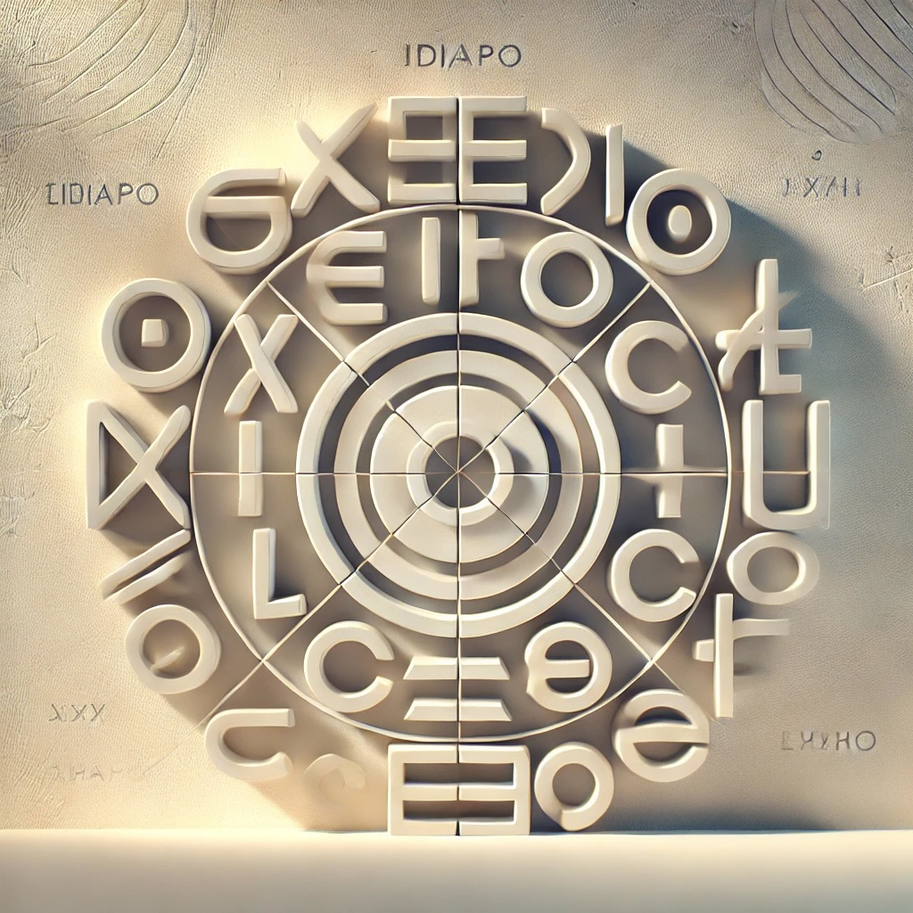

# L’idiapo: langue de l’évidentialité (version zéro)

Date de publication: 9 février 2025

# Idiapo : Une Langue Minimaliste avec Évidentialité

## Une langue diogéniale



Je m’intéresse à la philosophie cynique via le projet diogénial. Et j’ai découvert le toki pona. C’était l’occasion de jouer avec les nouvelles IA de raisonnement pour créer une langue minimaliste: l’idiapo.

Les langues minimalistes cherchent à exprimer un maximum d'idées avec un vocabulaire réduit. **Idiapo** s'inscrit dans cette tradition en s'inspirant du **Toki Pona**, tout en y ajoutant un élément fondamental des langues amérindiennes : **l’évidentialité**. Cette caractéristique permet d’indiquer clairement la source d'une information (expérience directe ou rapportée), ce qui influence profondément la manière dont la communication fonctionne. Ce serait d’ailleurs très utile sur les réseaux sociaux.

# Un langage hybride homme/LLM

Idiapo est destiné à être implanté dans un LLM. C’est lui qui invente des solutions pour exprimer des notions complexes à partir d’un vocabulaire et d’une grammaire limités.

---

## **L'évidentialité en Idiapo : Qui sait quoi ?**

Idiapo repose sur deux **marqueurs d'évidentialité** obligatoires en début de phrase :

- **idi** (ιδι) → Connaissance directe (ce que l’on a vu, entendu, ressenti soi-même).
- **apo** (απο) → Connaissance indirecte (ce qu’on a appris d’une autre source, entendu dire).

Exemple :

- **idi ego ein agape** → *Je ressens de l’amour* (parce que c’est mon ressenti direct).
- **apo autos ein tapeinos** → *On m’a dit qu’il est humble* (je le sais via une autre source).

L’ajout de ces marqueurs transforme la manière de transmettre l’information. Dans une conversation, cela permet d’éviter les malentendus sur la fiabilité d’une déclaration.

---

## **Une structure grammaticale simple et modulaire**

Chaque phrase suit une structure fixe en Idiapo :

```
[Marqueur d’évidentialité] [Sujet] [ein] [Prédicat] [ant + Objet Direct] [pla + Contexte]

```

- **`ein`** relie le sujet au prédicat, comme un verbe être/faire.
- **`ant`** introduit un objet direct.
- **`pla`** ajoute des précisions de lieu, temps ou conditions.

Exemple :

- **idi anthropos ein rakoun ant ichthys pla chronos**
→ *J’ai vu une personne qui chasse un poisson aujourd’hui*.

Ici, **"idi"** signale que l’événement a été directement observé par le locuteur.

---

## **Un vocabulaire réduit mais expressif**

Idiapo adopte une approche minimaliste du vocabulaire, inspirée du Toki Pona. Plutôt que d’avoir des mots précis pour chaque concept, on assemble des mots existants pour créer du sens.

Exemple :

- **ti echo** → "ce que je possède" (possessions, ressources)
- **ti lego** → "ce qui est dit" (langage, discours, information)
- **kathreptes ein logos** → *Le miroir est un mot* (métaphore pour *réflexion*).

Ce procédé oblige à une pensée plus conceptuelle et synthétique, en simplifiant la communication.

# Le temps

Idiapo n’a pas de conjugaison. C’est le LLM qui doit trouver une solution pour, par exemple, exprimer le passé:

La phrase « Je suis heureux » en Idiapo peut être traduite comme suit :

**idi ego ein agape**

Explication :

- **idi** → Marqueur d’évidence directe (car c'est une expérience personnelle).
- **ego** → « Je ».
- **ein** → Relie le sujet au prédicat (« être »).
- **agape** → « Amour », utilisé ici pour exprimer un état de bonheur.

En Idiapo, pour exprimer le passé, on peut ajouter **telos** (« fin, passé ») comme marqueur de temps.

La traduction de **« j'étais heureux »** serait :

➡ **idi ego ein agape pla telos**

Cela signifie littéralement **« Je suis amour dans le passé »**, correspondant à **« J’étais heureux »** en français.

---

## **Une écriture en idéogrammes ?**

Idiapo pourrait aussi être écrit à l’aide **d’idéogrammes**, simplifiant encore plus la communication. Chaque mot-clé pourrait être représenté par un symbole unique, similaire à l'approche du chinois ou du japonais kanji.

Exemple hypothétique :

- **idi ego ein esthio ant ichthys** *(Je mange du poisson)*
    
    **𐤀 ᚩ 𐀁 ◇ 𐀤 √**
    

### Explication des idéogrammes :

- **𐤀** → *idi* (évidence directe).
- **ᚩ** → *ego* (je, moi).
- **𐀁** → *ein* (être, relier sujet et prédicat).
- **◇** → *esthio* (manger, consommer).
- **𐀤** → *ant* (marqueur de l'objet direct).
- **√** → *ichthys* (poisson).

Ceci est l'équivalent idiapo-idéographique de **"Je mange du poisson"**.

Cette approche iconographique pourrait donner naissance à un **langage visuel universel** qui transcende la diversité des langues écrites.

---

## **Idiapo : Une langue pensée pour une communication épurée et fiable**

Loin des langues naturelles souvent alourdies par l’ambiguïté et la polysémie, **Idiapo** vise une communication **claire, minimaliste et précise**. L’évidentialité, en forçant le locuteur à clarifier la source de son information, permet d’éviter **les malentendus et la désinformation**.

Avec son **vocabulaire réduit, sa structure modulaire et son potentiel d’écriture en idéogrammes**, Idiapo pourrait devenir un outil puissant pour l’expression rapide et efficace des idées essentielles.

# Annexe: vocabulaire de l’idiapo (148 mots ou symboles)

| Grec | Translittération | Français | Sym |
| --- | --- | --- | --- |
| ειν | ein | être | 𐀁 |
| αντ | ant | COD | 𐀤 |
| πλα | pla | contexte | 𐀳 |
| ιδι | idi | connaissance par soi-même (évidence directe) | 𐤀 |
| απο | apo | savoir indirect (évidence indirecte) | 𐌀 |
| ἐπιφωνή | epiphone | interjection | ᚠ |
| σαύρα | savra | lézard ou reptile | ∑ |
| οὐ | ou | non, pas, zéro | → |
| διώκω | dioko | chasser | ● |
| πᾶς | pas | tous, 100 | 𐊀 |
| ταπεινός | tapeinos | bas, humble | 𐤁 |
| ἕτερος | heteros | différent, autre | 𐌁 |
| ἢ | ē | ou | ᚡ |
| αἰσχύνη | aischune | honte, culpabilité | ∏ |
| ὑπομένω | hypomeno | endurer, attendre, continuer | ↔ |
| καί | kai | et | ○ |
| ἔπος | epos | (humoristique) épique | 𐊁 |
| ἀγορά | agora | marché, commerce | 𐤂 |
| πρᾶγμα | pragma | chose, objet, affaire | 𐌂 |
| κακός | kakos | mauvais, superflu | ᚢ |
| αὐτός | autos | (archaïque, obscur) il, elle, cela, ils, elles | 𐊃 |
| ἐργαλεῖον | ergaleion | outil, dispositif | ∫ |
| ἔσω | eso | intérieur, estomac | ↑ |
| βρώμικος | bromikos | sale, dégoûtant | ■ |
| ἄνθρωπος | anthropos | personne, humain | 𐊂 |
| καθρέφτης | kathreptes | (peu commun) réflexion, miroir | 𐤃 |
| ξανθός | xanthos | jaune, vert clair | 𐌃 |
| ἔχω | echo | avoir, tenir | ᚣ |
| ἰχθύς | ichthys | poisson, créature marine | √ |
| φωνή | phone | son, bruit, réciter | ↓ |
| ἔρχομαι | erchomai | venir, devenir | □ |
| σὺν | syn | avec, ensemble | 𐊃 |
| λόφος | lofos | bosse, colline | 𐤄 |
| φαιός | phaios | (rare) brun, gris | 𐌄 |
| φυτόν | phyton | plante | ᚤ |
| δύναμαι | dunamai | pouvoir, possible | ∞ |
| χρησιμοποιῶ | chresimo | en utilisant | ↔ |
| ρακούν | rakoun | raton laveur | 𐊄 |
| καρπός | karpos | fruit, légume | 𐤅 |
| ὡσαύτως | hosautos | aussi, également | 𐌅 |
| μερίζω | merizo | couper, diviser, partie | ᚥ |
| πέτρα | petra | dur, solide, pierre | ∆ |
| σκόνη | skone | pâte, poudre | ↕ |
| πνεῦμα | pneuma | air, esprit | 𐊅 |
| χρώμα | chroma | couleur, peint | 𐤆 |
| κοινότης | koinotes | groupe, communauté | 𐌆 |
| ἀκούω | akouo | oreille, entendre, écouter, obéir | ᚦ |
| λαμβάνω | lambano | saisir, prendre, voler | ∂ |
| καθεύδω | katheudo | dormir, se reposer | ↖ |
| κύανος | kyanos | bleu, vert | ▼ |
| κεφαλή | kephale | tête, esprit, contrôler, mener | 𐊆 |
| τετράγωνον | tetragonon | bloc, carré | 𐤇 |
| ὑφαστόν | hyphaston | tissu, vêtement, couverture, intimité | 𐌇 |
| ψυχρός | psychros | froid, frais, cru | ᚧ |
| μικρός | mikros | petit, jeune | ⊕ |
| νήμα | nema | ligne, ficelle, cheveu | ↗ |
| πάπυρος | papyros | objet plat, papier, document | ▽ |
| ἐρυθρός | erythros | rouge | 𐊇 |
| ὤν | on | à, dans, sur, réel, vrai, exister | 𐤈 |
| χείρ | cheir | main, bras, cinq | 𐌈 |
| ὀφθαλμός | ophthalmos | œil, voir, regarder, essayer | ᚨ |
| πόρος | poros | trou, porte, orifice, fenêtre | ⊗ |
| γῆ | ge | terre, pays | ↘ |
| πρόγονος | progonos | parent, ancêtre, créateur, gardien | ◆ |
| πλοῦτος | ploutos | argent, richesse, bétail | 𐊈 |
| γυνή | gyne | femme, féminin, épouse | 𐤉 |
| μέσος | mesos | moyen, médium | 𐌉 |
| ἐγώ | ego | je, moi, nous | ᚩ |
| ἀνήρ | aner | homme, masculin, mari | ⊥ |
| φάρμακον | pharmakon | médicament, guérison | ↙ |
| ἐσθίω | esthio | manger, consommer, nourriture | ◇ |
| θνῄσκω | thnesko | mort, mourir, décès, tuer | 𐊉 |
| ὄπισθεν | opisthen | arrière, dos | 𐤊 |
| τέρας | teras | monstre, peur, danger, effrayant | 𐌊 |
| ζῷον | zoon | animal | ⟲ |
| σελήνη | selene | lune, objet du ciel nocturne | ⇨ |
| ψυχαγωγία | psychagogia | amusement, jeu, récréation, art, divertissement | ★ |
| πολύς | polus | beaucoup, très, plusieurs, abondant, nombreux, plus | ☆ |
| ἠ | eh | euh, hmm | • |
| πρόσθετος | prosthetos | suppléant, additionnel, épice, saison, embellir | ◦ |
| ἀριθμός | arithmos | nombre | ▹ |
| παράξενος | paraxenos | étrange, idiot, ivre, (non standard, proscrit) fou, cinglé | ▸ |
| μέθοδος | methodos | manière, coutume, route, chemin, doctrine, système, méthode | ◂ |
| κορυφή | koryphe | bosse, colline, montagne, bouton, nez | ◃ |
| οὗτος | houtos | ceci, cela | ⬢ |
| λόγος | logos | mot, nom | ⬡ |
| πούς | pous | jambe, pied, organe de locomotion ; base | ⬣ |
| ὀφθαλμέ | ophthalme | œil | 𐊀 |
| ἀγάπη | agape | amour, respect | 𐊁 |
| ἐκεῖνος | ekeinos | il, elle, cela, ils, elles | 𐊂 |
| ἀνοίγω | anoigo | ouvrir, commencer | 𐊃 |
| σφάλμα | sphalma | bévue, accident, erreur, destruction, dommage, casser | 𐊄 |
| ποιέω | poieo | faire, activité, travail, acte, projet | 𐊅 |
| ῥάβδος | rhabdos | objet long et dur (ex. tige, bâton, branche) | 𐊆 |
| σῖτος | sitos | grain, céréale ; pain, pâtes | 𐊇 |
| δίδωμι | dido | donner, mettre, envoyer, placer, libérer, émettre | 𐊈 |
| εὐκόλως | eukolos | facile | 𐊉 |
| ἀδελφός | adelphos | frère/soeur | 𐊊 |
| τροποποιός | tropopoios | marqueur de phrase modificateur | 𐊋 |
| καρδία | kardia | sentiments, émotion, cœur | 𐊌 |
| μέλας | melas | noir, sombre, ombre | 𐊍 |
| τέλος | telos | fin, terminer, arrêter, passé | 𐊎 |
| ἔντομον | entomon | insecte | 𐊏 |
| τέτταρα | tetta | (archaïque, obscur) quatre | 𐊐 |
| πλευρά | pleura | côté, hanche, à côté, proximité | 𐊑 |
| κιβωτός | kibotos | conteneur, boîte, bol | 𐊒 |
| χρηστός | chrestos | bon, simple, utile | 𐊓 |
| ψευδής | pseudes | faux, factice, trompeur | 𐊔 |
| ὅμοιος | homoios | même, similaire, égal, comme | 𐤌 |
| πῦρ | pyr | feu, chaleur | 𐤍 |
| ἔξω | exo | extérieur, surface, peau, limite | ∝ |
| τί | ti | quoi, lequel | ⟲ |
| ὕψος | hypsos | haut, en haut, au-dessus, sacré | 𐊏 |
| σῶμα | soma | corps, état physique, torse | 𐤔 |
| κύκλος | kyklos | cercle, roue, balle, année | 𐌔 |
| καινός | kainos | nouveau, frais, un autre | ᚴ |
| σύ | sy | toi, vous | ≈ |
| πρόσωπον | prosopon | devant, mur, poitrine, visage | ⤴ |
| εἰκών | eikon | image, écrire, dessiner | ◂ |
| μύκητας | myketas | champignon, fungus | 𐊐 |
| σοφία | sophia | savoir, information, sagesse | 𐤑 |
| θηρίον | therion | animal (surtout mammifère terrestre) | 𐌑 |
| μέγας | megas | grand, haut, long, important, adulte | ᚱ |
| ἥλιος | helios | soleil, lumière | ≠ |
| τράπεζα | trapeza | surface de soutien (plateforme, meuble, table, chaise) | ⤵ |
| γλυκύς | glykys | doux, mignon, sucre | ◃ |
| διὰ | dia | de, à cause de, cause | 𐊒 |
| μόνο | mono | mais, seulement | 𐤒 |
| βαδίζω | badizo | à, pour, bouger, aller | 𐌒 |
| ὕδωρ | hydor | eau, liquide, mouillé, laver, boisson | ᚲ |
| χρόνος | chronos | temps, moment, période, situation | ≤ |
| λέγω | lego | dire, discours, langue | ↺ |
| οἶκος | oikos | maison, bâtiment, pièce | ⬢ |
| ἀμφιφυλικός | amphiphylikos | non‑binaire | ⬡ |
| δύο | dyo | deux, diviser en deux | 𐤓 |
| τρεῖς | treis | (archaïque, obscur) trois | 𐌓 |
| φύλος | phylos | sexe, sexuel | ᚳ |
| πορφύρα | porphyra | pourpre | ≥ |
| στόμα | stoma | bouche, lèvres, mâchoire, oral | ↻ |
| μάχη | mache | conflit, bataille, combattre, concourir | ⬡ |
| λευκός | leukos | blanc, de couleur claire | 𐊓 |
| εἷς | heis | un, unique, unir | 𐤔 |
| ὄρνις | ornis | oiseau, animal ailé | 𐌔 |
| ἰσχυρός | ischyros | fort, puissance, énergie | ᚴ |
| μακρόθεν | makrothen | loin, absent, manquant | ∝ |
| βούλομαι | boulomai | vouloir, besoin, désir, devoir | ⟲ |

# Préprompt

Le projet est disponible sur [github](https://github.com/l0d0v1c/Idiapo).

Ce préprompt contient la grammaire et le vocabulaire pour permettre d’utiliser un LLM

# Exemple d’usage

Traduction de:

<aside>
💡

Ne menez plus tel déconfort :
Jeunes ans sont petites pertes ;
Votre âge est plus mûr et plus fort
Que ces jeunesses mal expertes. (Clément Marot)

Voici la traduction en **Idiapo** 

**ou kephale telos poieo ant aischune :
mikros chronos ein mikros merizo ;
sy chronos ein polus mesos kai ischyros
ant houtos mikros anthropos ou sophia.**

---

### Explication phrase par phrase :

1. **ou kephale telos poieo ant aischune**
    
    → *Ne menez plus tel déconfort*
    
    - **ou** → « Ne… pas » (négation).
    - **kephale** → « tête, esprit, mener » (pour « menez »).
    - **telos** → « fin, arrêter » (indiquant « plus », dans le sens de ne plus faire quelque chose).
    - **poieo** → « faire, créer, agir ».
    - **ant aischune** → « en tant qu’objet direct : honte, culpabilité » (ici traduit comme « déconfort »).
2. **mikros chronos ein mikros merizo**
    
    → *Jeunes ans sont petites pertes*
    
    - **mikros chronos** → « petit temps » (signifiant « jeunes ans »).
    - **ein** → « être ».
    - **mikros merizo** → « petite division, petite perte ».
3. **sy chronos ein polus mesos kai ischyros**
    
    → *Votre âge est plus mûr et plus fort*
    
    - **sy** → « toi, vous ».
    - **chronos** → « temps » (signifiant « âge »).
    - **ein** → « être ».
    - **polus mesos** → « très moyen » (pour exprimer la maturité).
    - **kai ischyros** → « et fort ».
4. **ant houtos mikros anthropos ou sophia**
    
    → *Que ces jeunesses mal expertes*
    
    - **ant houtos** → « en comparaison de cela ».
    - **mikros anthropos** → « petits humains » (pour désigner « jeunes »).
    - **ou sophia** → « pas sagesse » (pour exprimer « mal expertes »).

---

Soit en idéogrammes:

**→ → 𐊆 𐊎 𐊅 𐀤 ∏ :**

**⊕ ≤ 𐀁 ⊕ ᚥ ;**

**≈ ≤ 𐀁 ☆ 𐌉 ○ ᚴ**

**𐀤 ⬢ ⊕ 𐊂 → 𐤑.**

</aside>

# Utilisation de la librairie python idiapo

Tous les LLM sont utilisable avec idiapo. Dans cet exemple j’ai utilisé deepseek-r1-qwen-2.5-32B-ablated-Q4_K_M avec LM studio. Attention à augmenter la fenêtre de contexte à plus de 30000.

Exemple type:

```python
import idiapo

# Initialisation de la classe
translator = idiapo.IdiapoTranslator()

# Exemples d'actions
print("Action FRID:")
print(translator.action('FRID', 'Je suis heureux.'))

print("\nAction IDFR:")
print(translator.action('IDFR', 'idi ego ein agape.'))

print("\nAction FRIDj:")
print(translator.action('FRIDj', 'Je suis heureux.'))

**Réponse :**

idi ego ein agape kai poieo

*Explication :*
- `idi` : Évidence directe (expérience personnelle).
- `ego` : Je, moi.
- `ein` : Relie le sujet au prédicat.
- `agape` : Amour, respect (ici utilisé pour exprimer l'état d'être heureux).
- `kai` : Et.
- `poieo` : Faire/créer (exprime l'action ou l'activité qui procure le bonheur).
```

FRID traduit en idiapo, IDFR en français. L’ajout de “j” (FRIDj) permet de sortir des résultats en JSON.

Pour traduire en idéogrammes:

```python
from idiapo import SymbolTranslator

translator=SymbolTranslator()
print(translator.translit_to_sym('idi ego ein agape kai poieo'))

print(translator.sym_to_translit('𐤀ᚩ𐀁𐊁○𐊅'))

```
# Références
* https://diogenial.com
* Sonja Lang, Toki Pona:The Language of Good, 978-0-9782923-0-0